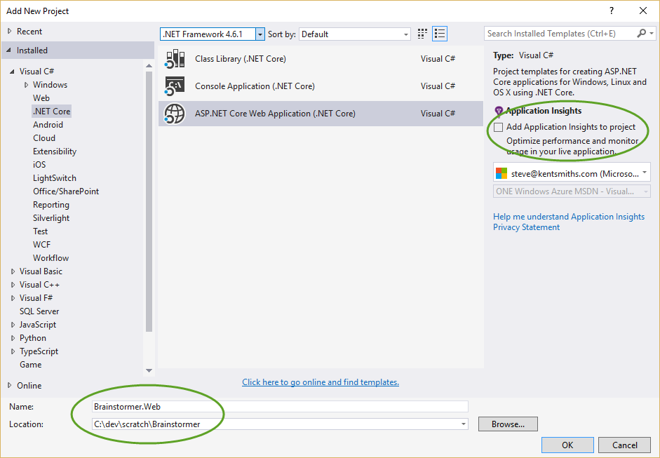
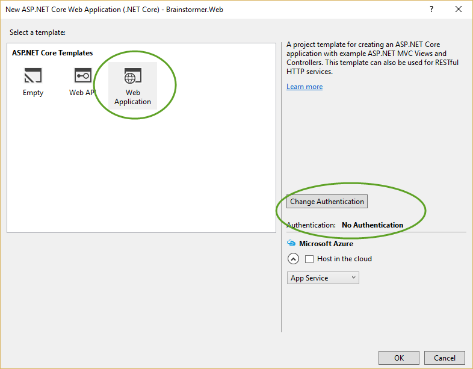
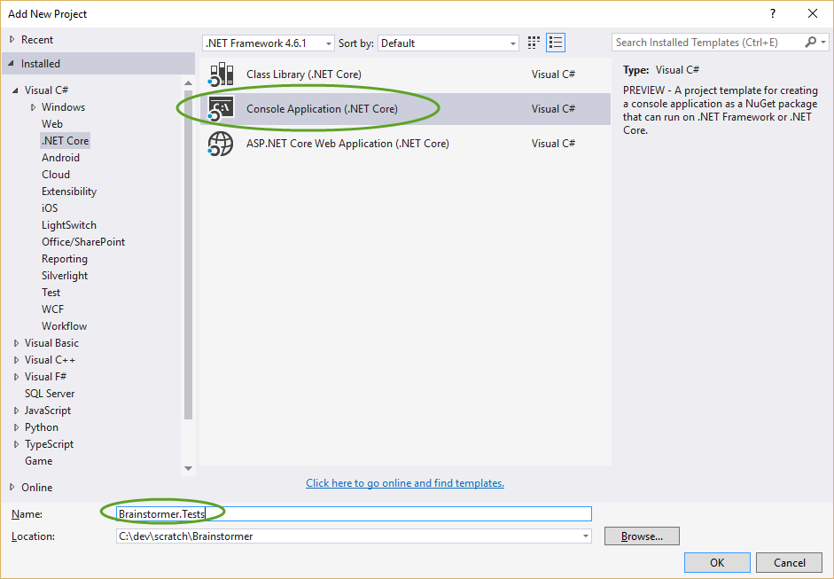
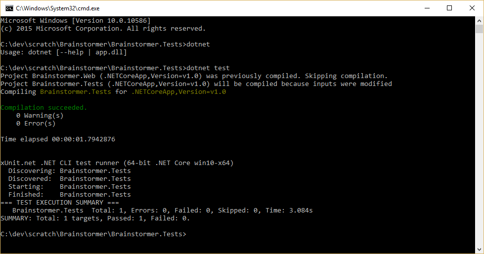

# Testing Data-Driven MVC Apps

## Open Visual Studio - Create Solution Structure

1. Create a new Empty Solution called "Brainstormer"


1. Right click on the Solution. Add > New Project. Create a new ASP.NET Core Web Application project (don't add any user accounts) called "Brainstormer.Web". Don't add Application Insights.



1. Choose Web Application. Click "Change Authentication" and make sure Authentication is set to "No Authentication".



1. Once the project is created, test it with CTRL+F5 and confirm it runs.

### Configure XUnit

1. Add another New Project to the solution. Choose a .NET Core Console Application and name it "Brainstormer.Tests".



1. Open the **test project's** *project.json* and update its entire contents as follows:

    ```JSON
{
  "version": "1.0.0-*",

  "dependencies": {
    "Microsoft.NETCore.App": {
      "type": "platform",
      "version": "1.0.0-rc2-3002702"
    },
    "xunit": "2.1.0",
    "dotnet-test-xunit": "1.0.0-rc2-*",
    "Microsoft.AspNetCore.TestHost": "1.0.0-rc2-final",
    "Brainstormer.Web": "1.0.0-*",
    "Newtonsoft.Json": "8.0.3"
  },
  "testRunner": "xunit",
  "frameworks": {
    "netcoreapp1.0": {
      "imports": [
        "dotnet5.4",
        "portable-net451+win8"
      ]
    }
  }
}
    ```

Note that "Brainstormer.Web" must match the name you gave the web project.

1. Add a new folder to the test project called "IntegrationTests".

1. Add a new class called "TestStartup" and edit it to contain the following:

    ```c#
using Microsoft.AspNetCore.Builder;
using Microsoft.Extensions.DependencyInjection;

namespace Brainstormer.Tests.IntegrationTests
{
    public class TestStartup
    {
        public void ConfigureServices(IServiceCollection services)
        {
            services.AddMvc();
        }

        public void Configure(IApplicationBuilder app)
        {
            app.UseMvc(routes =>
            {
                routes.MapRoute(
                    name: "default",
                    template: "{controller=Home}/{action=Index}/{id?}");
            });
        }
    }
}    
    ```

1. Add another class called "TestHostingEnvironment":

    ```c#
using Microsoft.AspNetCore.Hosting;
using Microsoft.Extensions.FileProviders;

namespace Brainstormer.Tests.IntegrationTests
{
    public class TestHostingEnvironment : IHostingEnvironment
    {
        public string EnvironmentName { get; set; }
        public string ApplicationName { get; set; }
        public string WebRootPath { get; set; }
        public IFileProvider WebRootFileProvider { get; set; }
        public string ContentRootPath { get; set; }
        public IFileProvider ContentRootFileProvider { get; set; }
    }
}
    ```

1. Integration tests use instances of ``HttpClient``, which are creatd from a ``TestServer``. You can do this in each test, but that tends to get repetitive, so the last helper class you need is a "TestClientFactory":

    ```c#
using System.IO;
using System.Net.Http;
using System.Net.Http.Headers;
using Microsoft.AspNetCore.Hosting;
using Microsoft.AspNetCore.TestHost;
using Microsoft.Extensions.DependencyInjection;
using Microsoft.Extensions.FileProviders;
using Microsoft.Extensions.PlatformAbstractions;

namespace Brainstormer.Tests.IntegrationTests
{
    public class TestClientFactory
    {
        public static HttpClient Create()
        {
            var builder = new WebHostBuilder()
                .ConfigureServices(services =>
                {
                    var env = new TestHostingEnvironment();
                    env.ContentRootPath = Path.GetFullPath(Path.Combine(
                        PlatformServices.Default.Application.ApplicationBasePath,
                        "..", "..", "..", "..", "Brainstormer.Web"));
                    env.ContentRootFileProvider = new PhysicalFileProvider(env.ContentRootPath);
                    env.WebRootPath = env.ContentRootPath;
                    env.WebRootFileProvider = new PhysicalFileProvider(env.WebRootPath);
                    env.ApplicationName = "Brainstormer.Web";
                    services.AddSingleton<IHostingEnvironment>(env);
                })
                .UseEnvironment("Testing")
                .UseStartup<TestStartup>();
            var server = new TestServer(builder);
            return server.CreateClient();
        }
    }
}
    ```
The TestHostingEnvironment and its related path properties are necessary for Views to be accessed correctly. Otherwise, the tests will look for the views in the test project, not the web project.

1. Now you're ready to add your first test. You can verify that a request to "/" returns OK by adding the following class, "HomeControllerShould":

    ```c#
using System.Net.Http;
using Xunit;


namespace Brainstormer.Tests.IntegrationTests
{
    public class HomeControllerShould
    {
        private readonly HttpClient _client;

        public HomeControllerShould()
        {
            _client = TestClientFactory.Create();
        }

        [Fact]
        public async void ReturnOkGivenRootPathRequest()
        {
            var response = await _client.GetAsync("/");
            response.EnsureSuccessStatusCode();
        }
    }
}
    ```

1. Run the tests. You can do this from Visual Studio, or from a command prompt (in the test project folder) via ``dotnet test``. Run from the command line, you should see:



## Add API Functionality to Web Project

1. Add a new Models folder to the web project. In it, add a new class "Idea":

    ```c#
using System;

namespace Brainstormer.Web.Models
{
    public class Idea
    {
        public int Id { get; set; }
        public string Name { get; set; }
        public string Description { get; set; }
        public DateTimeOffset DateCreated { get; set; }
    }
}    
    ```

1. Add a new "AppDbContext" class to the Models folder:

    ```c#
using Microsoft.EntityFrameworkCore;

namespace Brainstormer.Web.Models
{
    public class AppDbContext : DbContext
    {
        public AppDbContext(DbContextOptions options):base(options)
        {
        }
        public DbSet<Idea> Ideas { get; set; }
    }
}    
    ```
Visual Studio should prompt you to add the package ``"Microsoft.EntityFrameworkCore": "1.0.0-rc2-final"``

1. Add support for Entity Framework in ``ConfigureServices`` in *Startup*:

    ```c#
public void ConfigureServices(IServiceCollection services)
{
    services.AddDbContext<AppDbContext>(options => options.UseInMemoryDatabase());
    // Add framework services.
    services.AddMvc();
}
    ```
Visual Studio should prompt you to add the package ``"Microsoft.EntityFrameworkCore.InMemory": "1.0.0-rc2-final"``

1. Add a new "Interfaces" folder and add an "IIdeaRepository" interface type to it:

    ```c#
using System.Collections.Generic;
using Brainstormer.Web.Models;

namespace Brainstormer.Web.Interfaces
{
    public interface IIdeaRepository
    {
        Idea GetById(int id);
        List<Idea> List();
        void Create(Idea idea);
    }
}    
    ```

1. Add an implementation of this interface to the Models folder. Call it EfIdeaRepository.

    ```c#
using System.Collections.Generic;
using Brainstormer.Web.Interfaces;
using System.Linq;

namespace Brainstormer.Web.Models
{
    public class EfIdeaRepository : IIdeaRepository
    {
        private readonly AppDbContext _dbContext;

        public EfIdeaRepository(AppDbContext dbContext)
        {
            _dbContext = dbContext;
        }

        public Idea GetById(int id)
        {
            return _dbContext.Ideas.FirstOrDefault(i => i.Id == id);
        }

        public List<Idea> List()
        {
            return _dbContext.Ideas.ToList();

        }

        public void Create(Idea idea)
        {
            // calculate max id
            int maxId = _dbContext.Ideas.Any() ? _dbContext.Ideas.Max(i => i.Id) : 0;
            idea.Id = maxId + 1;
            _dbContext.Ideas.Add(idea);
            _dbContext.SaveChanges();
        }

    }
}    
    ```

1. Now add a new IdeasController to the Controllers folder:

    ```c#
using Brainstormer.Web.Interfaces;
using Brainstormer.Web.Models;
using Microsoft.AspNetCore.Mvc;

namespace Brainstormer.Web.Controllers
{
    [Route("api/ideas")]
    public class IdeasController : Controller
    {
        private readonly IIdeaRepository _ideaRepository;

        public IdeasController(IIdeaRepository ideaRepository)
        {
            _ideaRepository = ideaRepository;
        }

        [HttpGet]
        [Route("{ideaId}")]
        public IActionResult Get(int ideaId)
        {
            var result = _ideaRepository.GetById(ideaId);
            return Ok(result);
        }

        [HttpGet]
        public IActionResult Get()
        {
            var result = _ideaRepository.List();
            return Ok(result);
        }

        [HttpPost]
        public IActionResult Create([FromBody] Idea idea)
        {
            _ideaRepository.Create(idea);
            return Ok(idea);
        }
    }
}    
    ```

1. Now wire up the repository implementation to the interface in ``ConfigureServices`` in *Startup*:

    ```c#
public void ConfigureServices(IServiceCollection services)
    {
        services.AddDbContext<AppDbContext>(options => options.UseInMemoryDatabase());
        // Add framework services.
        services.AddMvc();
        services.AddScoped<IIdeaRepository, EfIdeaRepository>();
    }
    ```

1. Run the application. Navigate to /api/Ideas. You should see an empty result.

1. Post an Idea using Fiddler/Postman; you can just supply a Name and Description:

    ```json
{
 "Name":"An idea",
 "Description":"A brilliant idea",
}
    ```

1. Refresh /api/Ideas to see the idea that was added.

### Testing the API

1. Create a new test class to test IdeasController.

    ```c#
using System.Net;
using System.Net.Http;
using System.Net.Http.Headers;
using System.Threading.Tasks;
using Brainstormer.Web;
using Microsoft.AspNetCore.Hosting;
using Microsoft.AspNetCore.TestHost;
using Xunit;


namespace Brainstormer.Tests.IntegrationTests
{
    public class IdeasControllerShould
    {
        private readonly HttpClient _client;

        public IdeasControllerShould()
        {
            var builder = new WebHostBuilder()
                .UseEnvironment("Development")
                .UseStartup<Startup>();
            var server = new TestServer(builder);
            _client = server.CreateClient();

            // client always expects json results
            _client.DefaultRequestHeaders.Clear();
            _client.DefaultRequestHeaders.Accept.Add(
                new MediaTypeWithQualityHeaderValue("application/json"));

        }

        [Fact]
        public async void ReturnOkOnGet()
        {
            var response = await _client.GetAsync("/api/ideas");
            response.EnsureSuccessStatusCode();
        }

        [Fact]
        public async Task GetReturnsNotFoundForInvalidId()
        {
            var response = await _client.GetAsync("/api/ideas/5000");
            Assert.Equal(HttpStatusCode.NotFound, response.StatusCode);
        }

    }
}
    ```

1. Run the tests. The second test should fail.

1. Make the test pass by adding some code to the IdeasController Get method:

    ```c#
[HttpGet]
[Route("{ideaId}")]
public IActionResult Get(int ideaId)
{
    var result = _ideaRepository.GetById(ideaId);
    if (result == null)
    {
        return NotFound(ideaId);
    }
    return Ok(result);
}
    ```

1. See if you can add additional tests for IdeasController (or improve the ones shown here).


